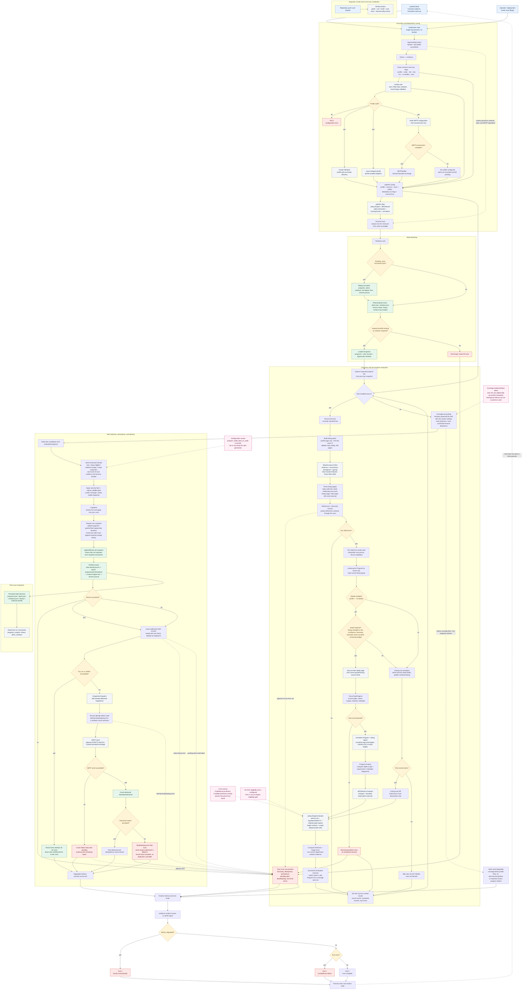

```mermaid
flowchart TD
  timer["systemd.timer<br/>5-minute cadence; Persistent catch-up"] --> main
  operator["Operator / deployment<br/>hunter scan [flags]"] --> main

  subgraph invocation["Invocation and dependency wiring"]
    main["cmd/hunter main<br/>single-shot process; no listener"] --> signalCtx["signal.NotifyContext<br/>SIGINT / SIGTERM cancellation"]
    signalCtx --> runCLI["cli.Run -> cmdScan"]
    runCLI --> flags["Parse common and scan flags<br/>--profile, --state, --full, --dry-run, --no-details, --json"]
    flags --> profileLoad["config.Load<br/>strict YAML keys; defaults; enum/range validation"]
    profileLoad --> profileValid{"Profile valid?"}
    profileValid -- no --> badConfig["Exit 2<br/>configuration error"]
    profileValid -- yes --> storeWire["Create FileStore<br/>profile path and state directory"]
    profileValid -- yes --> sourceWire["source.Registry.Build<br/>profile-enabled adapters"]
    profileValid -- yes --> notifierEnv["Read SMTP configuration<br/>from environment only"]
    notifierEnv --> notifierReady{"SMTP environment complete?"}
    notifierReady -- yes --> smtpNotifier["SMTPNotifier<br/>timeout-bounded exchange"]
    notifierReady -- no --> noNotifier["No notifier configured<br/>alerts are recorded and left pending"]
    storeWire --> pipelineCfg
    sourceWire --> pipelineCfg
    smtpNotifier --> pipelineCfg
    noNotifier --> pipelineCfg
    profileLoad --> pipelineCfg
    flags --> pipelineCfg
    pipelineCfg["pipeline.Config<br/>profile + sources + store + notifier<br/>details/dry-run flags + concurrency"] --> components["pipeline.New<br/>policy.Engine + diff.Detector<br/>alerts.Generator + scoring.Scorer + normalizer"]
    components --> scanStart["Scanner.Scan<br/>assign scan ID; reset per-scan catch-up budget"]
  end

  signalCtx -.->|context passed to network, state, and SMTP operations| scanStart

  subgraph bootstrap["State bootstrap"]
    scanStart --> loadState["FileStore.Load"]
    loadState --> journalQ{"Pending .save-transaction.json?"}
    journalQ -- yes --> replayTxn["Replay journaled programs, alerts,<br/>windows, and digest; then remove journal"]
    journalQ -- no --> readState
    replayTxn --> readState["Read programs.json, alerts.json, windows.json<br/>Ensure maps; history remains lazy-loaded"]
    readState --> digestQ{"material.sha256 missing<br/>or matches snapshot?"}
    digestQ -- yes --> snapshot["Loaded Snapshot<br/>programs + alert records + opportunity windows"]
    digestQ -- no --> stateFail["ErrCorrupt / state I/O error"]
  end

  subgraph sourceScan["Discovery and per-program evaluation"]
    snapshot --> expected["Capture expected program IDs<br/>from pre-scan snapshot"]
    expected --> sourceNext{"Next enabled source?"}
    pipelineCfg --> sourceNext
    sourceNext -- yes --> discover["Source.Discover<br/>currently HackenProof"]
    discover --> paths["Build listing paths<br/>profile page cap; --full sets cap to 0<br/>adapter hard ceiling: 200 pages"]
    paths --> listingHTTP["Shared source.Client<br/>timeouts + concurrency semaphore + pacing<br/>retry transient failures; honor Retry-After"]
    listingHTTP --> listingParse["Parse listing pages<br/>keep valid refs; retain malformed-row errors<br/>empty page / later-page 404 ends traversal"]
    listingParse --> listingResult["References + discovery error(s)<br/>partial references continue through the scan"]
    listingResult -.->|append to scan error set| errors
    listingResult --> hasRefs{"Any references?"}
    hasRefs -- no --> sourceJoin
    hasRefs -- yes --> workerPool["Per-reference worker pool<br/>min(profile concurrency, source capability)"]
    workerPool --> priorLookup["Lookup prior Program by source key<br/>read current listing signal"]
    priorLookup --> detailsEnabled{"Details enabled?<br/>profile + --no-details"}
    detailsEnabled -- yes --> needDetail{"Detail required?<br/>listing changed or low confidence; otherwise<br/>new/stale catch-up within remaining budget"}
    detailsEnabled -- no --> listingOnly
    needDetail -- yes --> detailFetch["Source.Fetch detail page<br/>uses same paced/retrying source.Client"]
    needDetail -- no --> listingOnly["Listing-only evaluation<br/>retain previous detail fields; update LastSeen/listing"]
    detailFetch --> detailParse["Parse RawProgram<br/>access gates, status, scopes, rewards, metadata"]
    detailParse --> parsedQ{"Raw record parsed?"}
    parsedQ -- no --> evalError["Record parse/fetch error<br/>no evaluated outcome"]
    parsedQ -- yes --> normalize["normalize.Program + listing signal<br/>normalize tags and targets; classify only in-scope targets"]
    normalize --> finalize["Program.Finalize<br/>compute stable scope / requirement / metadata fingerprints"]
    finalize --> diff["diff.Detector.Compare<br/>changes + bounded observation intervals"]
    listingOnly --> priorAvailable{"Prior record exists?"}
    priorAvailable -- yes --> listingDiff["Listing-only Diff<br/>submission-count observation only"]
    priorAvailable -- no --> listingSkip["Skip new record if details were not fetched"]
    listingDiff --> policy
    diff --> policy["policy.Engine.Evaluate<br/>parse trust + reputation/fee/KYC + state/accepts-reports<br/>target surfaces + crypto allow/exclude rules"]
    policy --> scored["Compute freshness + triage score<br/>use current opportunity-window evidence"]
    scored --> evaluated["Successful Evaluated outcome<br/>collect metrics; add Program ID to coverage seen set"]
    listingSkip --> sourceJoin
    evalError --> errors
    evalError --> sourceJoin
    evaluated --> sourceJoin["Join this source's worker results<br/>record counts, evaluated records, and errors"]
    sourceJoin --> sourceNext
    sourceNext -- no --> coverage["Coverage accounting<br/>compare expected IDs with seen IDs; grace sweeps;<br/>mark absences / evict confirmed terminal departures"]
  end

  sourceResultNote["Coverage implementation detail<br/>seen IDs are added after successful evaluation;<br/>fetch/parse failures are not counted as seen"] -.-> coverage

  subgraph decision["Alert selection, persistence, and delivery"]
    coverage --> alertsBuild["Build alert candidates from evaluated programs"]
    alertsBuild --> triggerSelect["alerts.Generator.Decide<br/>new / newly eligible / material change / scope expansion<br/>each uses its own evidence and recency window"]
    triggerSelect --> gates["Apply severity floor + require_eligible gate<br/>render message; create stable fingerprint"]
    gates --> cap["CapAlerts<br/>priority-sort and apply max_per_scan"]
    cap --> persistPrep["Prepare one snapshot<br/>update programs; open/refresh opportunity windows;<br/>record new alert rows; append material-change history"]
    persistPrep --> historyWrite["AppendHistory per program<br/>history files are separate from snapshot transaction"]
    historyWrite --> saveTxn["FileStore.Save<br/>write-ahead journal -> atomic programs/alerts/windows<br/>-> material digest last -> remove journal"]
    saveTxn --> saveOK{"Persist successful?"}
    saveOK -- no --> errors
    saveOK -- yes --> pendingRead
    saveOK -- no --> pendingRead
    pendingRead["Load undelivered alert records<br/>merge with new alerts; dedupe by fingerprint"] --> deliveryMode{"Dry run or notifier unavailable?"}
    deliveryMode -- yes --> recordSkipped["Record alert attempt; do not send<br/>leave alert undelivered for a later scan"]
    deliveryMode -- no --> dispatch["Dispatcher.Dispatch<br/>skip already-delivered fingerprints"]
    dispatch --> attempt["Record attempt before send<br/>attempt-bookkeeping error is retained, send continues"]
    attempt --> smtpSend["SMTP send<br/>optional STARTTLS/AUTH; context-bounded exchange"]
    smtpSend --> sendOK{"SMTP send succeeded?"}
    sendOK -- no --> sendFail["Count failed; keep alert pending<br/>continue with remaining batch"]
    sendOK -- yes --> markDelivered["Count delivered; MarkAlertDelivered"]
    markDelivered --> markOK{"Delivered marker persisted?"}
    markOK -- yes --> sentDone["Alert delivered and idempotency record stored"]
    markOK -- no --> bookFail["Bookkeeping error fails scan<br/>send remains delivered=1, failed=0;<br/>record stays retryable, so duplicate is possible"]
    recordSkipped --> finishDelivery
    sendFail --> finishDelivery
    sentDone --> finishDelivery
    bookFail --> errors
    bookFail --> finishDelivery
    attempt -.->|attempt-bookkeeping error| errors
    sendFail -.->|delivery error| errors
    pendingRead -.->|state lookup error| errors
    finishDelivery["Aggregate delivery counters and errors"]
  end

  pendingRead -.->|pending-alert read failure| errors
  coverage -.->|below coverage floor / live programs absent| degraded
  errors["Scan error accumulator<br/>discovery, fetch/parse, persistence,<br/>pending-alert, bookkeeping, and send errors"] --> finish
  finishDelivery --> finish["Finalize metrics and error result"]
  degraded["Mark result degraded<br/>coverage below profile floor, no discovery/evaluation,<br/>or important known program absent"] --> finish
  finish --> report["cmdScan renders human or JSON report"]
  report --> degradedQ{"Metrics degraded?"}
  degradedQ -- yes --> exit3["Exit 3<br/>results untrustworthy"]
  degradedQ -- no --> errorQ{"Run error?"}
  errorQ -- yes --> exit1["Exit 1<br/>scan/delivery failure"]
  errorQ -- no --> exit0["Exit 0<br/>scan complete"]
  exit3 --> processExit["Process exits; host retains state"]
  exit1 --> processExit
  exit0 --> processExit
  processExit -.->|next timer tick starts a fresh process| timer

  subgraph inspection["Post-scan inspection"]
    snapshotFiles["Persisted state directory<br/>programs.json / alerts.json / windows.json / history/ / material.sha256"] --> queryCLI["Read-only CLI commands<br/>programs, explain, history, alerts, windows"]
  end
  saveTxn --> snapshotFiles

  stateFail --> errors
  errors --> finish

  stateRuleGap["Configuration caveat<br/>program_states.alert_on_state is parsed,<br/>but is not wired into alert generation"] -.-> triggerSelect
  parseNuance["Trust nuance<br/>ConfidenceLow blocks; ConfidencePartial currently<br/>passes the parse-trust check"] -.-> policy
  pocNote["No POC eligibility rule is configured<br/>POC is not an Engine eligibility gate"] -.-> policy

  subgraph ci["Separate CI path (not a live-scan scheduler)"]
    pushPR["Repository push / pull request"] --> checks["GitHub Actions<br/>gofmt + vet + build + race tests + fixture/config checks"]
  end

  classDef inputNode fill:#e8f1ff,stroke:#3973ac,color:#102a43
  classDef componentNode fill:#f4f5f7,stroke:#657786,color:#102a43
  classDef storageNode fill:#e7f6ec,stroke:#3b7a57,color:#153b25
  classDef decisionNode fill:#fff4d6,stroke:#b7791f,color:#4a3410
  classDef errorNode fill:#fde8e7,stroke:#b42318,color:#5b1714
  classDef caveatNode fill:#fff0f6,stroke:#c11574,color:#51123a
  class timer,operator,main,pushPR inputNode
  class profileLoad,sourceWire,storeWire,notifierEnv,listingHTTP,detailFetch,smtpSend,dispatch,policy,normalize,diff,components,checks,queryCLI componentNode
  class snapshot,readState,replayTxn,saveTxn,historyWrite,snapshotFiles,recordSkipped,markDelivered storageNode
  class profileValid,journalQ,digestQ,hasRefs,detailsEnabled,needDetail,parsedQ,priorAvailable,saveOK,deliveryMode,sendOK,markOK,degradedQ,errorQ,notifierReady decisionNode
  class badConfig,stateFail,evalError,sendFail,bookFail,errors,exit1,exit3 errorNode
  class sourceResultNote,stateRuleGap,parseNuance,pocNote caveatNode
```